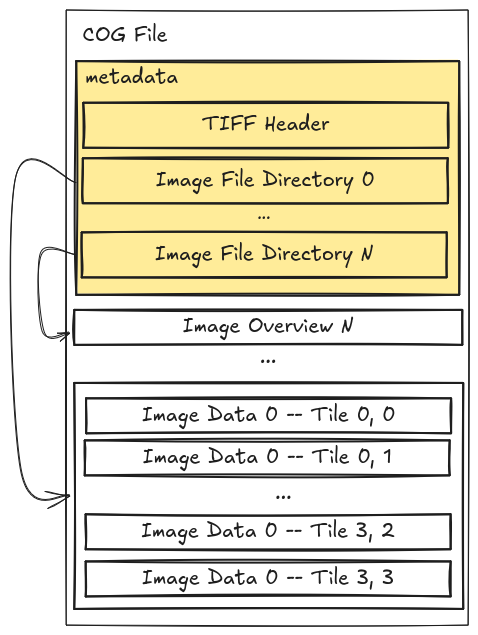
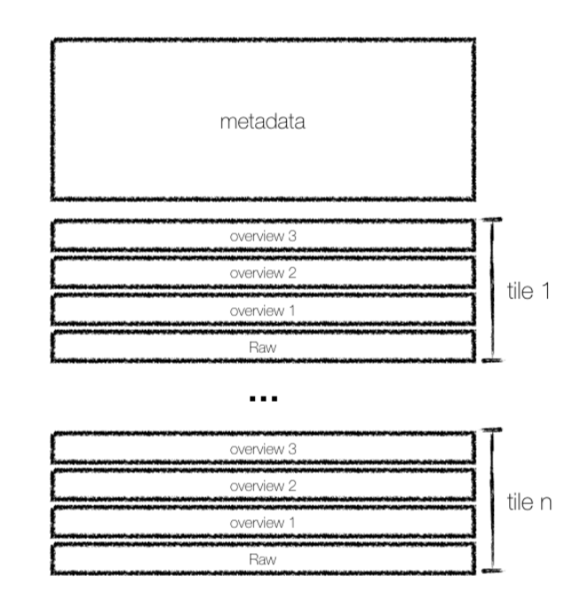

## About the speaker

:::: {.columns}

::: {.column width="30%"}

:::

::: {.column width="70%"}
**Kshitij Raj Sharma**

Open Source GIS Developer, author of [VirtuGhan](https://github.com/kshitijrajsharma/VirtuGhan) & other libraries.

Working with GeoAI at the intersection of OpenStreetMap, Earth Observation, and cloud-native data formats. Passionate about developing softwares that benefits human kind.

- krschap@proton.me
- [github.com/kshitijrajsharma](https://github.com/kshitijrajsharma)
- [kshitijrajsharma.com.np/about](https://kshitijrajsharma.com.np/about/)
:::

::::

## Outline

1. What is **Cloud Native Geospatial**, and why now?
2. **STAC**, how you discover the data
3. The **format landscape**, one table
4. **COG** vs **Zarr**
5. **Vector** formats: GeoParquet, FlatGeobuf, PMTiles, COPC
6. **Geo AI**: embeddings and models
7. A **decision tree**, and what you do tomorrow

# 1 · What is Cloud Native Geospatial?

## The problem

> "Geospatial data is experiencing **exponential growth** in both size and complexity. Traditional data access methods, such as file downloads, have become increasingly impractical for achieving scientific objectives."

::: {.fragment}
**Concrete numbers (2024 Copernicus Annual Report)**: the seven Copernicus Sentinels generate roughly **50 TB of data every day**. The Copernicus Data Space Ecosystem now holds **80 PB online** across **100M+ Sentinel products**.
:::

::: footer
Sources: <https://guide.cloudnativegeo.org/> · [CDSE Annual Report 2024](https://dataspace.copernicus.eu/news/2025-12-4-copernicus-data-space-ecosystem-cdse-releases-annual-report-2024) · [ESA Belém 2025](https://eo4society.esa.int/wp-content/uploads/2025/02/3_CDSE_Belem.pdf)
:::

## Why traditional methods fail

::: incremental
- Users **cannot reasonably wait** to download, store, and work with large files on their machines.
- Large volumes of data must be available via **subsetting methods**, accessed in memory, not on disk.
- Traditional formats are **optimized for on-disk access**. They do not account for network latency.
- Earth observation spans raster, vector, point cloud, and many formats. **There is no one-size-fits-all.**
:::

::: footer
Sources: <https://guide.cloudnativegeo.org/> · NASA Task 51 Cloud-Optimized Format Study
:::

## What cloud optimization gives us

::: incremental
- **Reduced latency.** Fetch subsets of the raw data, not whole files.
- **Scalability.** Object storage is infinitely scalable and serves many parallel reads.
- **Flexibility.** Query and filter on the server side, only the bytes you asked for are returned.
- **Cost-effectiveness.** Less data transfer, less storage, more compression options.
:::

::: footer
Source: <https://guide.cloudnativegeo.org/>
:::

## Why? The latency argument

::: {.columns}
::: {.column width="50%"}
**Old way**

::: incremental
1. Find a tile
2. Download a 1 GB scene
3. Unpack
4. Crop to AOI
5. Throw away 99% of bytes
6. Compute
:::
:::

::: {.column width="50%"}
**Cloud native**

::: incremental
1. STAC search by AOI + time
2. HTTP range read of chunks you need
3. Compute immediately
:::

::: {.fragment}
The "shipping" step disappears.
:::
:::
:::

# 2 · STAC, how you find data

## STAC is not a format

::: {.callout-important}
**STAC is how you find cloud-native data.**

Bytes are useless if you can't query for them.
:::

## STAC components

::: {.center-img}

:::

::: footer
Figure: <https://eopf-toolkit.github.io/eopf-101/04_eopf_and_stac/41_stac_intro.html>
:::

## Inside an Item

::: {.center-img}

:::

::: footer
Figure: <https://eopf-toolkit.github.io/eopf-101/04_eopf_and_stac/41_stac_intro.html>
:::

## Analogy, a drinks menu (or a Nepali tea shop)

::: {.center-img}

:::

**Catalog** → menu. **Collection** → "Tea", "Coffee". **Item** → "Masala chiya, 9 am". **Asset** → the cup.

::: footer
Figure: <https://eopf-toolkit.github.io/eopf-101/04_eopf_and_stac/41_stac_intro.html>
:::

## Live, 4 STAC catalogs in a browser

::: incremental
- **Earth Search**, [earth-search.aws.element84.com/v1](https://earth-search.aws.element84.com/v1) · Sentinel-2 L2A, the workhorse
- **OpenAerialMap / HOTOSM**, [stac-browser](https://radiantearth.github.io/stac-browser/#/external/api.imagery.hotosm.org/stac/) · drone + Maxar ARD
- **STAC for ML models**, [stac.fair.krschap.tech](https://stac.fair.krschap.tech) · "STAC isn't just for pixels"
- **EOPF Sample Service**, [stac.core.eopf.eodc.eu](https://stac.core.eopf.eodc.eu) · Zarr-native Sentinel
:::

# 3 · The format landscape

## Traditional → Cloud Native

::: {.center-img}

:::

::: footer
Figure: <https://guide.cloudnativegeo.org/>
:::

## The primitive: HTTP range requests

::: {.columns}
::: {.column width="55%"}

:::
::: {.column width="45%"}
The file lives on object storage. The client fetches **only the byte ranges it needs**.

- 1 request reads the **metadata header** (a few KB)
- N requests read the **chunks** that touch the AOI
- The rest of the file is never transferred

Cloud native = chunked file + HTTP range support + a reader that knows the layout.
:::
:::

::: footer
Figure: <https://guide.cloudnativegeo.org/>
:::

# 4 · Raster, COG vs Zarr

## COG, what it is

::: {.columns}
::: {.column width="55%"}

:::
::: {.column width="45%"}
- A **GeoTIFF** with a specific internal layout
- **Tiled** + **overviewed** (pyramid)
- One HTTP request fetches metadata, then range requests fetch only the tiles touching your AOI
- Backwards compatible: any GDAL tool reads it
:::
:::

::: footer
Figure: EOPF 101 · Spec: <https://cogeo.org/>
:::

## Zarr, what it is

::: {.columns}
::: {.column width="55%"}

:::
::: {.column width="45%"}
- Storage layout for **N-dimensional arrays**
- Each array split into **chunks**, each chunk is its own object
- Metadata is JSON next to the chunks
- Works on S3, GCS, local disk through the same code path
- Natural for **time stacks, multi-band cubes, embeddings**
:::
:::

::: footer
Figure: EOPF 101 · Spec: <https://zarr-specs.readthedocs.io/>
:::

## COG vs Zarr, side by side

::: {.center-img}

:::

::: footer
Figure: <https://element84.com/software-engineering/is-zarr-the-new-cog/>
:::

## The short answer

| If you have...                                | Reach for |
|-----------------------------------------------|-----------|
| Single 2D raster, one timestamp               | **COG**   |
| Map tiles, web visualisation                  | **COG**   |
| Time series across many dates, many bands     | **Zarr**  |
| Datacubes, ML training data, embeddings       | **Zarr**  |
| Multi-resolution previews                     | **COG**   |
| New ND science workflows                      | **Zarr**  |

::: footer
Source: <https://eopf-toolkit.github.io/eopf-101/01_about_eopf/12_about_cloudoptimized_formats.html>
:::

# 5 · Salzburg, live

## NDVI + NDWI from one Sentinel-2 COG

::: {.center-img}

:::

::: footer
STAC search → COG range read → arithmetic. No scene was fully downloaded.
:::

## A season of NDVI with VirtuGhan

::: {.center-img}

:::

::: footer
Median NDVI over Sentinel-2 scenes, June to August 2025, on-the-fly compute.
:::

# 6 · Vector formats

## GeoParquet, columnar vector with spatial pushdown

::: {.columns}
::: {.column width="55%"}

:::
::: {.column width="45%"}
- Apache Parquet + a `geometry` column + CRS in file-level metadata.
- **GeoParquet 1.1** adds a `bbox` covering column.
- Readers (`pyarrow`, `duckdb`, `geopandas`) **skip row groups** that do not intersect the query bbox.
- The backbone of **Overture Maps** and most modern open vector datasets.
:::
:::

::: footer
Figure: <https://guide.cloudnativegeo.org/> · Spec: <https://github.com/opengeospatial/geoparquet>
:::

## FlatGeobuf, single-file streaming with a packed R-tree

::: {.columns}
::: {.column width="55%"}

:::
::: {.column width="45%"}
- One binary file: header, features, then a **packed R-tree** at the end.
- `pyogrio.read_dataframe(url, bbox=...)` triggers a partial fetch: GDAL pulls only the feature blocks intersecting the bbox.
- Drop-in replacement for Shapefile and GeoPackage that works straight off S3.
:::
:::

::: footer
Figure: <https://guide.cloudnativegeo.org/> · Spec: <https://flatgeobuf.org/>
:::

## PMTiles, an entire tile pyramid in one file

::: {.columns}
::: {.column width="55%"}

:::
::: {.column width="45%"}
- MBTiles, reorganised as one S3-friendly file.
- A small **directory** at the head maps `(z, x, y)` → byte offset.
- The browser fetches the tiles in view via HTTP range requests, **no tile server**.
- Pairs with **Protomaps** for vector basemaps.
:::
:::

::: footer
Figure: <https://guide.cloudnativegeo.org/> · Spec: <https://docs.protomaps.com/pmtiles/>
:::

## COPC, cloud-optimized point clouds

::: {.columns}
::: {.column width="55%"}

:::
::: {.column width="45%"}
- A **LAZ 1.4** file with a specific **octree-clustered** ordering of points.
- A Variable Length Record (VLR) holds the chunk table.
- Same idea as COG, but for LiDAR: range-fetch only the octants you need.
- Tools: **PDAL**, **untwine**, browser COPC viewers.
:::
:::

::: footer
Figure: <https://copc.io/> · Spec: <https://copc.io/>
:::

# 7 · Geo AI

## Embeddings are arrays. Models are portable.

- An embedding is `(n_locations, n_dims)`, often `(time, lat, lon, n_dims)`. That is **Zarr**, or **GeoParquet** with the embedding as a list column.
- **ONNX** is "cloud-native" for models in the same spirit: portable, runtime-agnostic, streamable.
- The **STAC ML model extension** publishes models as Items alongside the data they were trained on.

> STAC isn't just for pixels.

::: footer
Refs: <https://geoembeddings.org/bestpractices.html> · <https://onnx.ai/> · <https://github.com/stac-extensions/ml-model>
:::

# 8 · Wrap

## A decision tree

```
Is your data...
├── 2D raster, single time?              → COG
├── ND raster, time series, cubes?       → Zarr
├── Vector, tabular + geometry?          → GeoParquet
├── Vector, single file, bbox reads?     → FlatGeobuf
├── Map tiles you want to serve flat?    → PMTiles
├── Point cloud?                         → COPC
├── Embeddings?                          → Zarr or GeoParquet
└── ML model?                            → ONNX, indexed in STAC
```

Always: **publish a STAC** so people can find it.

## Tomorrow, you write the code

You will:

::: incremental
- Query **Overture Maps** GeoParquet with **DuckDB**
- Turn an **OSM** PBF extract into GeoParquet with **QuackOSM**, then query and chunk it
- Stream a **FlatGeobuf** subset over HTTP
- Compute **NDVI** and **NDWI** over Salzburg from a Sentinel-2 COG via **STAC + xarray**
- Build a seasonal NDVI composite with **VirtuGhan**
- Open an **EOPF Zarr** Sentinel-2 product with `xarray-eopf`
:::

## Resources

- [guide.cloudnativegeo.org](https://guide.cloudnativegeo.org/)
- [eopf-toolkit.github.io/eopf-101](https://eopf-toolkit.github.io/eopf-101/)
- [element84.com · Is Zarr the new COG?](https://element84.com/software-engineering/is-zarr-the-new-cog/)
- [stacspec.org](https://stacspec.org/)
- [geoembeddings.org/bestpractices](https://geoembeddings.org/bestpractices.html)
- [pangeo.io](https://pangeo.io/) · [titiler](https://github.com/developmentseed/titiler)
- [VirtuGhan](https://github.com/kshitijrajsharma/VirtuGhan) · [QuackOSM](https://github.com/kraina-ai/quackosm)

## Credits

Slide figures reused with attribution:

- COG, Zarr, STAC components, STAC item, drinks-menu analogy: [EOPF 101](https://eopf-toolkit.github.io/eopf-101/), © ESA / Development Seed, CC-BY 4.0
- "Traditional → Cloud Native" format table: [Cloud Native Geo Guide](https://guide.cloudnativegeo.org/), CC-BY 4.0
- COG vs Zarr comparison: [Element 84, "Is Zarr the new COG?"](https://element84.com/software-engineering/is-zarr-the-new-cog/)
- GeoParquet query window, FlatGeobuf diagram, COG byte layout, PMTiles tile pyramid: [Cloud Native Geo Guide](https://guide.cloudnativegeo.org/), CC-BY 4.0
- COPC chunk-table illustration: [copc.io](https://copc.io/)
- Salzburg NDVI/NDWI + VirtuGhan composite: original, generated by the Day 2 raster notebook
- Speaker photo: [kshitijrajsharma.com.np](https://kshitijrajsharma.com.np/about/)

Built with [Quarto + RevealJS](https://quarto.org/docs/presentations/revealjs/). Source: [github.com/kshitijrajsharma/cng-workshop-materials](https://github.com/kshitijrajsharma/cng-workshop-materials).

## Slides + follow

::: {.qr-grid}
::: {}


**Slides**

virtughan.github.io/civis-workshop-eo-2026
:::

::: {}


**Repo**

github.com/kshitijrajsharma/cng-workshop-materials
:::
:::

##  {.center}

# Any questions?

. . .

# धन्यवाद · Thank you · Danke

::: {.r-fit-text}
Kshitij Raj Sharma · krschap@proton.me
:::
