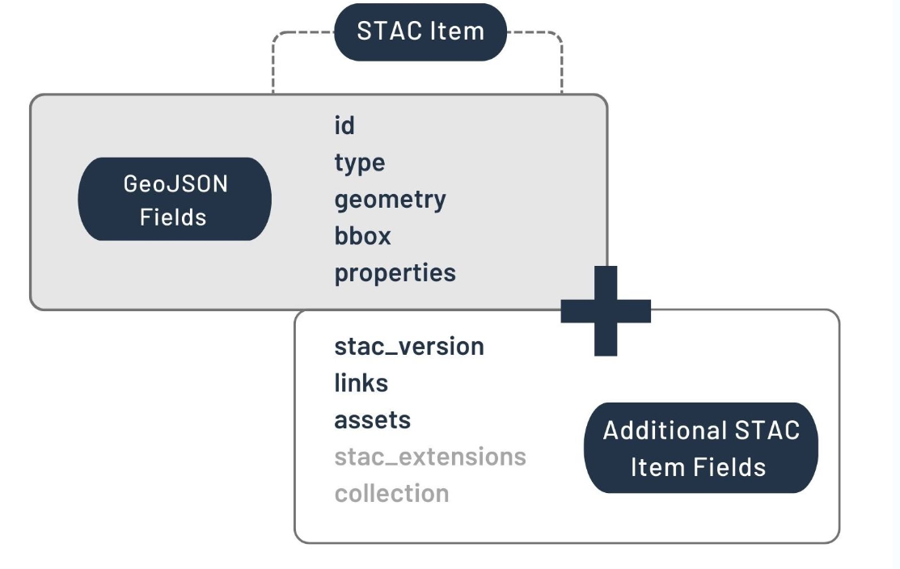
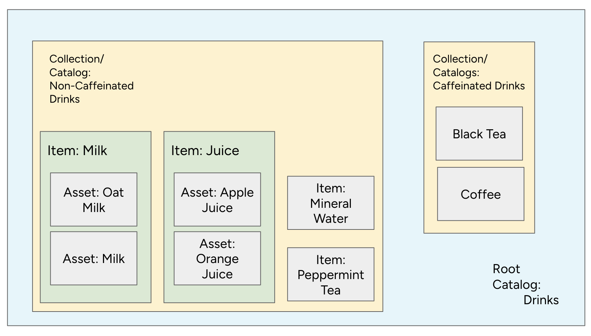
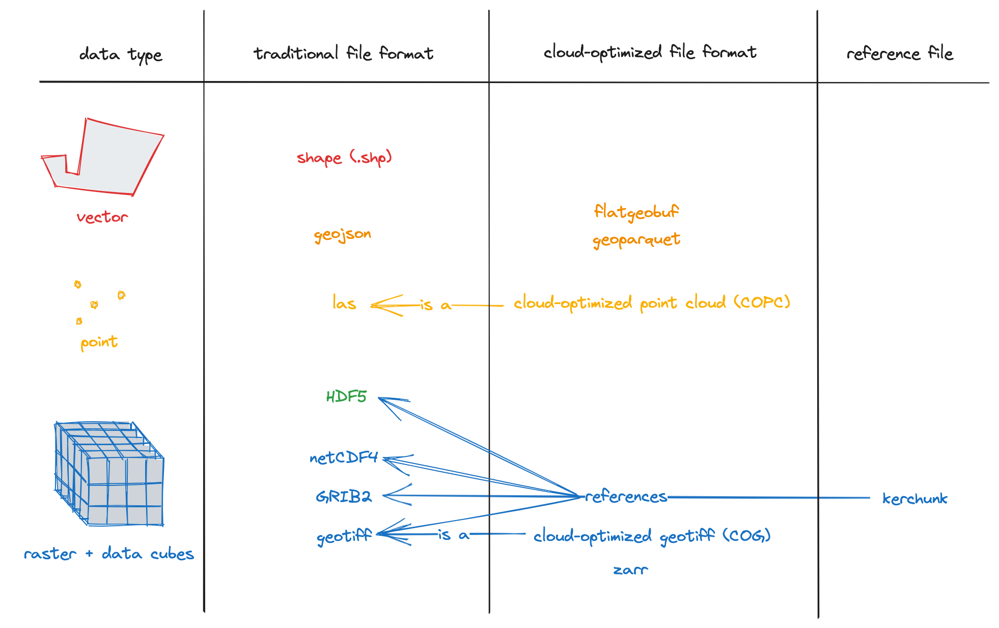
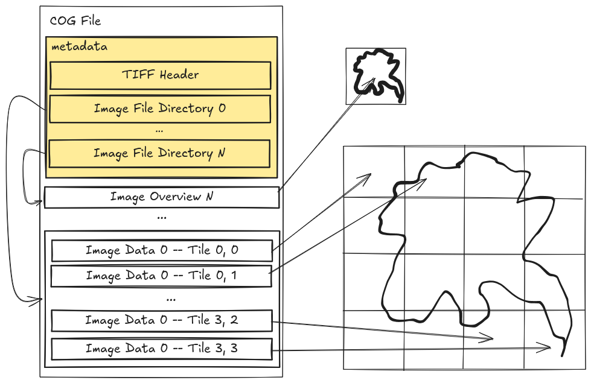
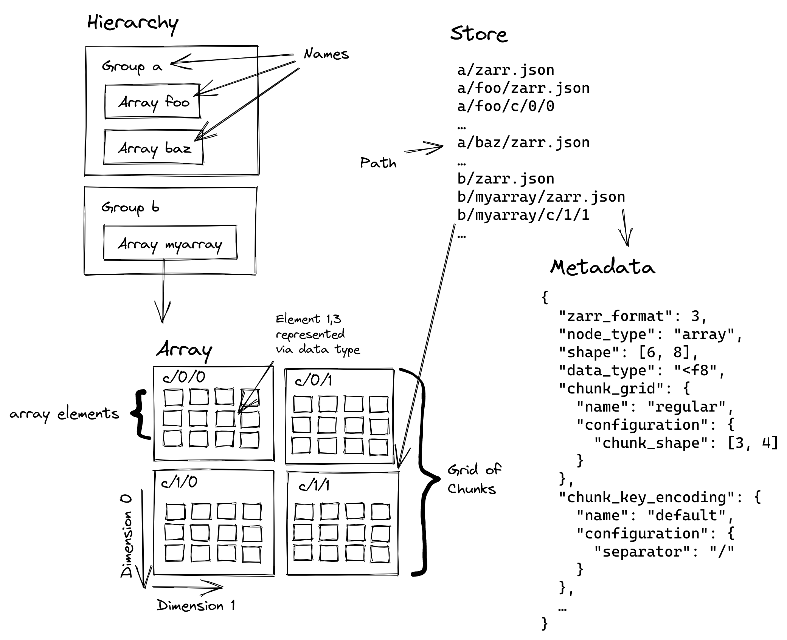
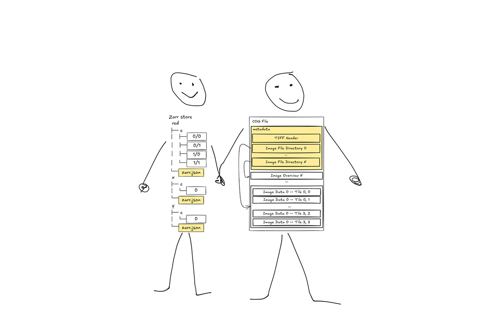
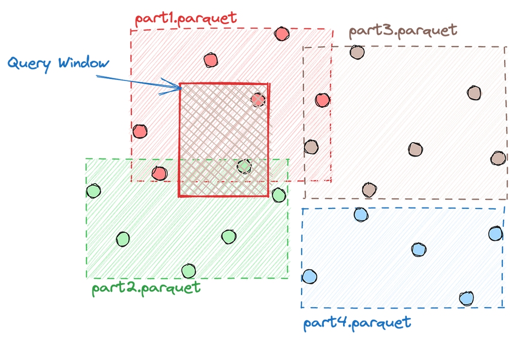
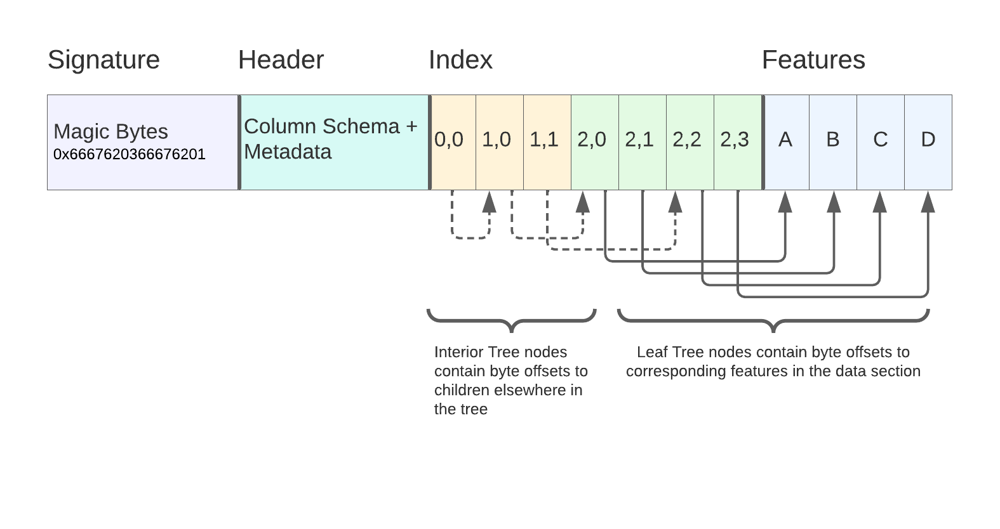
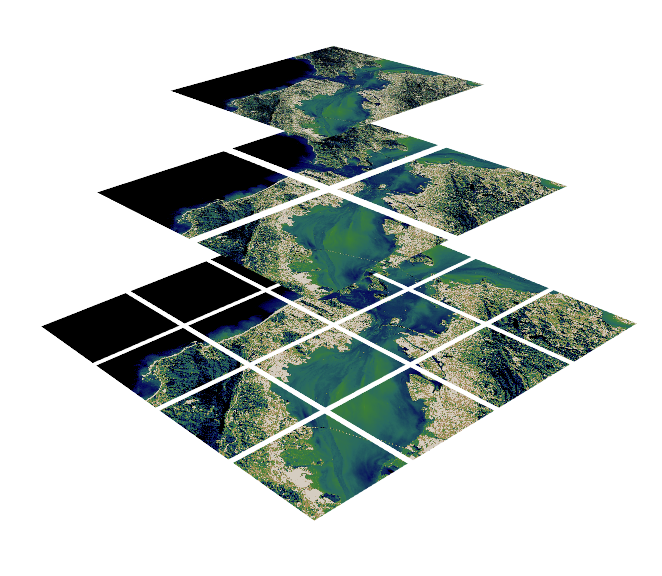
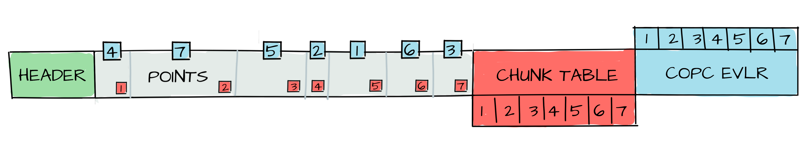

## About the speaker

:::: {.columns}

::: {.column width="30%"}

:::

::: {.column width="70%"}
**Kshitij Raj Sharma**

Open Source GIS Developer, author of [VirtuGhan](https://github.com/virtughan/virtughan) & other libraries.

Working with GeoAI at the intersection of OpenStreetMap, Earth Observation, and cloud-native data formats. Passionate about developing software that benefits humankind.

- krschap@proton.me
- [github.com/kshitijrajsharma](https://github.com/kshitijrajsharma)
- [kshitijrajsharma.com.np/about](https://kshitijrajsharma.com.np/about/)
:::

::::

## Outline

1. **Cloud Native Geospatial**
2. **STAC**
3. **CNG file formats**
4. **Raster formats**
5. **Vector formats**
6. **Geo AI**
7. **Wrap**: decision tree + what we do tomorrow

# 1 · Cloud Native Geospatial

## The problem

> "Geospatial data is experiencing **exponential growth** in both size and complexity. Traditional data access methods, such as file downloads, have become increasingly impractical for achieving scientific objectives."

::: {.fragment}
**Concrete numbers (2024 Copernicus Annual Report)**: the seven Copernicus Sentinels generate roughly **50 TB of data every day**. The Copernicus Data Space Ecosystem now holds **80 PB online** across **100M+ Sentinel products**.
:::

::: footer
Sources: <https://guide.cloudnativegeo.org/> · [CDSE Annual Report 2024](https://dataspace.copernicus.eu/news/2025-12-4-copernicus-data-space-ecosystem-cdse-releases-annual-report-2024) · [ESA Belém 2025](https://eo4society.esa.int/wp-content/uploads/2025/02/3_CDSE_Belem.pdf)
:::

## Why traditional methods fail

::: incremental
- Users **cannot reasonably wait** to download, store, and work with large files on their machines.
- Large volumes of data must be available via **subsetting methods**, accessed in memory, not on disk.
- Traditional formats are **optimized for on-disk access**. They do not account for network latency.
- Earth observation spans raster, vector, point cloud, and many formats. **There is no one-size-fits-all.**
:::

::: footer
Sources: <https://guide.cloudnativegeo.org/> · NASA Task 51 Cloud-Optimized Format Study
:::

## Benefits of cloud optimization

::: incremental
- **Reduced latency.** Fetch subsets of the raw data, not whole files.
- **Scalability.** Object storage is infinitely scalable and serves many parallel reads.
- **Flexibility.** Query and filter on the server side, only the bytes you asked for are returned.
- **Cost-effectiveness.** Less data transfer, less storage, more compression options.
:::

::: footer
Source: <https://guide.cloudnativegeo.org/>
:::

## Importance of cloud native geospatial

::: {.columns}
::: {.column width="50%"}
**Old way**

::: incremental
1. Find a tile
2. Download a 1 GB scene
3. Unpack
4. Crop to AOI
5. Throw away 99% of bytes
6. Compute
:::
:::

::: {.column width="50%"}
**Cloud native**

::: incremental
1. STAC search by AOI + time
2. HTTP range read of chunks you need
3. Compute immediately
:::

::: {.fragment}
The "shipping" step disappears.
:::
:::
:::

# 2 · STAC

## STAC

::: {.columns}
::: {.column width="55%"}

:::
::: {.column width="45%"}
**SpatioTemporal Asset Catalog.** A standard for describing geospatial data so any client can search a catalog by **space, time, and properties**, then fetch only the assets it needs. Specification + community.

::: {.callout-important}
**STAC is how you find cloud-native data.** Bytes are useless if you can't query for them.
:::
:::
:::

::: footer
Definition: <https://stacspec.org/en/about/> · Figure: <https://eopf-toolkit.github.io/eopf-101/04_eopf_and_stac/41_stac_intro.html>
:::

## What's in a STAC Item?

::: {.center-img}

:::

::: footer
Figure: <https://eopf-toolkit.github.io/eopf-101/04_eopf_and_stac/41_stac_intro.html>
:::

## STAC analogy: a drinks menu

::: {.center-img}

:::

**Catalog** → menu. **Collection** → "Tea", "Coffee". **Item** → "Masala chiya, 9 am". **Asset** → the cup.

::: footer
Figure: <https://eopf-toolkit.github.io/eopf-101/04_eopf_and_stac/41_stac_intro.html>
:::

## Examples of STAC catalogs

::: incremental
- **Earth Search** · Sentinel-2 L2A, the workhorse · [browse](https://radiantearth.github.io/stac-browser/#/external/earth-search.aws.element84.com/v1)
- **OpenAerialMap / HOTOSM** · drone + Maxar ARD · [browse](https://radiantearth.github.io/stac-browser/#/external/api.imagery.hotosm.org/stac/)
- **STAC for ML models** · "STAC isn't just for pixels" · [browse](https://radiantearth.github.io/stac-browser/#/external/stac.fair.krschap.tech)
- **EOPF Sample Service** · Zarr-native Sentinel · [browse](https://radiantearth.github.io/stac-browser/#/external/stac.core.eopf.eodc.eu)
:::

## Earth Search

<iframe src="https://radiantearth.github.io/stac-browser/#/external/earth-search.aws.element84.com/v1" width="950" height="520" style="display: block; margin: 0 auto; border: 1px solid #ccc;"></iframe>

## OpenAerialMap / HOTOSM

<iframe src="https://radiantearth.github.io/stac-browser/#/external/api.imagery.hotosm.org/stac/" width="950" height="520" style="display: block; margin: 0 auto; border: 1px solid #ccc;"></iframe>

## STAC for ML models

<iframe src="https://radiantearth.github.io/stac-browser/#/external/stac.fair.krschap.tech" width="950" height="520" style="display: block; margin: 0 auto; border: 1px solid #ccc;"></iframe>

## EOPF Sample Service

<iframe src="https://radiantearth.github.io/stac-browser/#/external/stac.core.eopf.eodc.eu" width="950" height="520" style="display: block; margin: 0 auto; border: 1px solid #ccc;"></iframe>

# 3 · CNG file formats

## Traditional -> Cloud Native

::: {.center-img}

:::

::: footer
Figure: <https://guide.cloudnativegeo.org/>
:::

## HTTP range requests

::: {.columns}
::: {.column width="50%"}
```{mermaid}
%%| fig-align: center
sequenceDiagram
    Client->>S3: Range: bytes=0-127
    S3-->>Client: header
    Client->>S3: Range: bytes=8K-12K
    S3-->>Client: chunk for AOI
```
:::
::: {.column width="50%"}
HTTP has supported partial downloads since 1999 (`Range: bytes=X-Y`). The file lives on object storage. The client fetches **only the byte ranges it needs**: 1 request for the header, N requests for the chunks touching the AOI. Only those bytes cross the wire; the rest of the 1.2 GB file stays put.

```{.http code-line-numbers="1-3|5-8"}
GET /austria_buildings.fgb HTTP/1.1
Host: huggingface.co
Range: bytes=0-127

HTTP/1.1 206 Partial Content
Content-Range: bytes 0-127/1264532992
Content-Length: 128
Accept-Ranges: bytes
```
:::
:::

# 4 · Raster formats

## Cloud Optimized GeoTIFF (COG)

> "A regular GeoTIFF file, aimed at being hosted on a HTTP file server, with an internal organization that enables more efficient workflows on the cloud."

::: {.columns}
::: {.column width="55%"}

:::
::: {.column width="45%"}
- **Tiled** + **overviewed** (pyramid)
- One HTTP request fetches metadata, then range requests fetch only the tiles touching your AOI
- Backwards compatible: any GDAL tool reads it as a regular GeoTIFF
:::
:::

::: footer
Definition + spec: <https://cogeo.org/> · Figure: [Element 84](https://element84.com/software-engineering/is-zarr-the-new-cog/)
:::

## Zarr

> "The open foundation for chunked, compressed, N-dimensional arrays."

::: {.columns}
::: {.column width="55%"}

:::
::: {.column width="45%"}
- Each array split into **chunks**, each chunk is its own object
- Metadata is JSON next to the chunks
- Works on S3, GCS, local disk through the same code path
- Natural for **time stacks, multi-band cubes, embeddings**
- ESA serves Sentinel as **EOPF Zarr** at [zarr.eopf.copernicus.eu](https://zarr.eopf.copernicus.eu/data-and-tools/), with GDAL / xarray / STAC plugins
:::
:::

::: footer
Definition: <https://zarr.dev/> · Spec: <https://zarr-specs.readthedocs.io/> · EOPF Zarr: <https://zarr.eopf.copernicus.eu/data-and-tools/> · Figure: EOPF 101
:::

## COG & Zarr

::: {.center-img}

:::

::: footer
Figure: <https://element84.com/software-engineering/is-zarr-the-new-cog/>
:::

## When to use which

| If you have...                                | Reach for |
|-----------------------------------------------|-----------|
| Single 2D raster, one timestamp               | **COG**   |
| Map tiles, web visualisation                  | **COG**   |
| Time series across many dates, many bands     | **Zarr**  |
| Datacubes, ML training data, embeddings       | **Zarr**  |
| Multi-resolution previews                     | **COG**   |
| New ND science workflows                      | **Zarr**  |

::: {.callout-note}
Element 84's take: the real question isn't COG **vs** Zarr, it's **how** you store inside either, tile/chunk sizes, compression, metadata, chosen for the access patterns you expect.
:::

::: footer
Source: <https://eopf-toolkit.github.io/eopf-101/01_about_eopf/12_about_cloudoptimized_formats.html> · [Element 84 conclusion](https://element84.com/software-engineering/is-zarr-the-new-cog/)
:::

# 5 · Vector formats

## GeoParquet

> "GeoParquet is an incubating Open Geospatial Consortium (OGC) standard that adds interoperable geospatial types (Point, Line, Polygon) to Parquet."

::: {.columns}
::: {.column width="55%"}

:::
::: {.column width="45%"}
- A `geometry` column + CRS in file-level metadata.
- **GeoParquet 1.1** adds a `bbox` covering column.
- Readers (`pyarrow`, `duckdb`, `geopandas`) **skip row groups** that do not intersect the query bbox.
- The backbone of **Overture Maps** and most modern open vector datasets.
:::
:::

::: footer
Definition: <https://geoparquet.org/> · Spec: <https://github.com/opengeospatial/geoparquet> · Figure: <https://guide.cloudnativegeo.org/>
:::

## FlatGeobuf

> "A performant binary encoding for geographic data based on flatbuffers that can hold a collection of Simple Features."

::: {.columns}
::: {.column width="55%"}

:::
::: {.column width="45%"}
- One binary file: magic bytes, header, optional **packed Hilbert R-tree**, then features.
- `pyogrio.read_dataframe(url, bbox=...)` triggers a partial fetch: GDAL pulls only the feature blocks intersecting the bbox.
- Drop-in replacement for Shapefile and GeoPackage that works straight off S3.
:::
:::

::: footer
Definition + spec: <https://flatgeobuf.org/> · Figure: <https://guide.cloudnativegeo.org/>
:::

## PMTiles

> "PMTiles is a single-file archive format for tiled data, usually used for visualization. It is designed to be a cloud-native file format: used directly from a client over a network via HTTP range requests, without having a server in the middle."

::: {.columns}
::: {.column width="55%"}

:::
::: {.column width="45%"}
- A single file holding the tiles + a directory mapping `(z, x, y)` → byte offset.
- Pairs with **Protomaps** for vector basemaps.

::: {.callout-important}
**Server-free.** A static file on object storage plus a viewer in the browser is the entire stack.
:::
:::
:::

::: footer
Definition: <https://guide.cloudnativegeo.org/pmtiles/intro.html> · Spec: <https://docs.protomaps.com/pmtiles/>
:::

## Austria Buildings

<iframe src="https://pmtiles.io/?url=https://huggingface.co/datasets/kshitijrajsharma/cng-workshop-materials/resolve/main/austria_buildings.pmtiles" width="950" height="500" style="display: block; margin: 0 auto; border: 1px solid #ccc;"></iframe>

::: footer
~1.5 GB of buildings served via HTTP range requests from Hugging Face, straight to the browser.
:::

## Cloud Optimized Point Cloud (COPC)

> "Geospatial, compressed, range-readable, LAZ-compatible point cloud format. A COPC file is a LAZ 1.4 file that stores point data organized in a clustered octree."

::: {.columns}
::: {.column width="55%"}

:::
::: {.column width="45%"}
- A Variable Length Record (VLR) holds the chunk table.
- Same idea as COG, but for LiDAR: range-fetch only the octants you need.
- Tools: **PDAL**, **untwine**, browser COPC viewers.
:::
:::

::: footer
Definition + spec: <https://copc.io/>
:::

# 6 · Geo AI

## Embeddings and models

An **embedding** is a learned vector that summarises what's in a pixel or feature. Two pixels with similar land cover get similar vectors, so distance in vector space ≈ similarity on the ground. Datasets like Alpha Earth publish a 64-D embedding for every 10 m Sentinel-2 pixel on Earth.

- Embeddings: use **blob storage with HTTP range-read support**. **Zarr** for regular grids, **GeoParquet** for sparse or irregular.
- **ONNX** is "cloud-native" for models in the same spirit: portable, runtime-agnostic, streamable.
- The **STAC ML model extension** publishes models as Items alongside the data they were trained on.

::: {.callout-tip}
**STAC isn't just for pixels.** The same discovery layer that finds Sentinel-2 scenes also finds the models you'd run on them.
:::

::: footer
Refs: <https://geoembeddings.org/bestpractices.html> · <https://onnx.ai/> · <https://github.com/stac-extensions/ml-model>
:::

# 7 · Wrap

## Decision tree

```{mermaid}
%%| fig-align: center
%%| fig-width: 6
%%| fig-height: 4
%%{init: {"theme":"neutral","themeVariables":{"primaryColor":"#ffffff","primaryTextColor":"#000000","primaryBorderColor":"#000000","lineColor":"#000000","secondaryColor":"#ffffff","tertiaryColor":"#ffffff","fontFamily":"inherit"}}}%%
flowchart TD
  Q([Your data?]) --> R{Raster?}
  Q --> V{Vector?}
  Q --> O{Other?}
  R -->|2D| COG
  R -->|N-D| Zarr
  V -->|Tabular| GeoParquet
  V -->|Bbox reads| FlatGeobuf
  V -->|Map tiles| PMTiles
  O -->|Point cloud| COPC
  O -->|Embeddings| EG[Zarr / GeoParquet]
  O -->|ML model| ML[ONNX + STAC ML]
```

Always: **publish a STAC** so people can find it.

## Tomorrow, we write the code

**Day 2 / Vector** ([notebook](../notebooks/01_vector.qmd))

::: incremental
- Query **Overture Maps** planet-scale GeoParquet on S3 with **DuckDB**, extract POIs for Salzburg
- Inspect **GeoParquet 1.1** metadata + bbox-stream the Salzburg subset of the 1.4 GB Austria buildings file
- Inspect **FlatGeobuf** header + packed R-tree on the same file, bbox-stream over HTTP
- Read the **PMTiles** header via HTTP range requests, view all of Austria in `pmtiles.io`
- Bonus: cluster **Alpha Earth** 64-D embeddings (Zarr on Source Cooperative S3)
:::

**Day 2 / Raster** ([notebook](../notebooks/02_raster.qmd))

::: incremental
- **STAC**-search Sentinel-2 L2A over Salzburg, pick the cleanest scene
- Compute NDVI + NDWI **three ways**: COG (`rioxarray`), Zarr (EOPF Sample Service), on-the-fly (**VirtuGhan**)
- Build two NDVI **datacubes** for the growing season (xarray + COG; VirtuGhan timeseries), compare the median trends
:::

## Resources

- [guide.cloudnativegeo.org](https://guide.cloudnativegeo.org/)
- [eopf-toolkit.github.io/eopf-101](https://eopf-toolkit.github.io/eopf-101/)
- [element84.com · Is Zarr the new COG?](https://element84.com/software-engineering/is-zarr-the-new-cog/)
- [stacspec.org](https://stacspec.org/)
- [geoembeddings.org/bestpractices](https://geoembeddings.org/bestpractices.html)
- [pangeo.io](https://pangeo.io/) · [titiler](https://github.com/developmentseed/titiler)
- [VirtuGhan](https://github.com/virtughan/virtughan) · [QuackOSM](https://github.com/kraina-ai/quackosm)
- [EOPF toolkit launch](https://developmentseed.org/blog/2025-07-14-eopf-toolkit/) (Development Seed)

## Credits

Slide figures reused with attribution:

- COG, Zarr, STAC components, STAC item, drinks-menu analogy: [EOPF 101](https://eopf-toolkit.github.io/eopf-101/), © ESA / Development Seed, CC-BY 4.0
- "Traditional → Cloud Native" format table: [Cloud Native Geo Guide](https://guide.cloudnativegeo.org/), CC-BY 4.0
- COG & Zarr comparison: [Element 84, "Is Zarr the new COG?"](https://element84.com/software-engineering/is-zarr-the-new-cog/)
- GeoParquet query window, FlatGeobuf diagram, COG byte layout, PMTiles tile pyramid: [Cloud Native Geo Guide](https://guide.cloudnativegeo.org/), CC-BY 4.0
- COPC chunk-table illustration: [copc.io](https://copc.io/)
- COG file-structure diagram: [Element 84](https://element84.com/software-engineering/is-zarr-the-new-cog/)
- Salzburg NDVI/NDWI + VirtuGhan composite: original, generated by the Day 2 raster notebook
- Speaker photo: [kshitijrajsharma.com.np](https://kshitijrajsharma.com.np/about/)

Built with [Quarto + RevealJS](https://quarto.org/docs/presentations/revealjs/). Source: [github.com/kshitijrajsharma/cng-workshop-materials](https://github.com/kshitijrajsharma/cng-workshop-materials).

# Any questions? {.center}

 धन्यवाद · Thank you · Danke · Bonjour

::: {.qr-grid}
::: {}


**Slides**

kshitijrajsharma.github.io/cng-workshop-materials
:::

::: {}


**Repo · Buy me a coffee**

github.com/kshitijrajsharma/cng-workshop-materials
:::
:::

 krschap@proton.me &nbsp; · &nbsp;  Kshitij Raj Sharma
